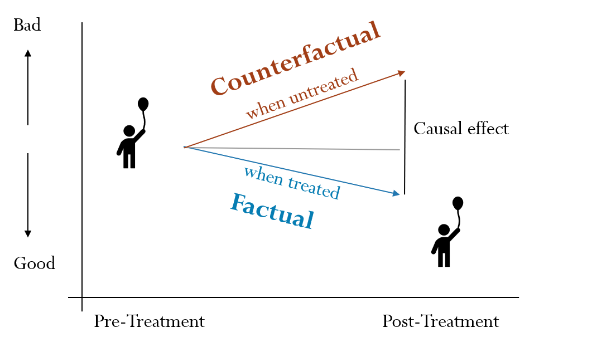

**Why causal inference?**

Causal effects describe the expected change in outcome in response to an intervention (e.g., program, treatment) when compared with a baseline condition. Take a clinical program for foster youth. We want to know that the therapy helps the child. Ideally, we want to know the difference for the child with and without the treatment. When evaluating a program, we might also want to know the different effects of the intervention for different subgroups. How do get an estimate of a causal effect?



