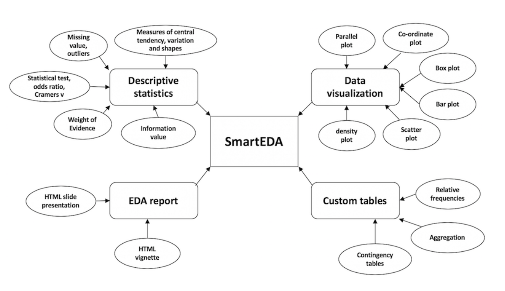

There are multiple R packages you can use for exploratory data analysis. In this post we will introduce four packages (SmartEDA, DataExplorer, Skimr, and Hmisc) along with a few base functions. Our primary focus will be on [SmartEDA](https://www.rdocumentation.org/packages/SmartEDA/versions/0.3.7).




Let's load 5 csv files with child welfare program data from github:

```{r, warning=FALSE, message=FALSE}

# Load tidyverse 

library(tidyverse)

# Upload data

clients <- read_csv("https://raw.githubusercontent.com/jwesleyfurlong/Tutorials/main/pe_data_clients.csv")

clinical <-  read_csv("https://raw.githubusercontent.com/jwesleyfurlong/Tutorials/main/pe_data_clinical.csv")

discharges <-  read_csv("https://raw.githubusercontent.com/jwesleyfurlong/Tutorials/main/pe_data_discharges.csv")

permanency <-  read_csv("https://raw.githubusercontent.com/jwesleyfurlong/Tutorials/main/pe_data_permanency.csv")

reports <- read_csv( "https://raw.githubusercontent.com/jwesleyfurlong/Tutorials/main/pe_data_discharges.csv")


```

Before looking at R packages for EDA, let's look at a few useful base functions.

```{r, warning=FALSE, message=FALSE}

# Structure of the data

str(clients)

```

Notice the typo in the variable name 'race_etnicity.' We will want to fix that during pre-processing. Date of birth and admission_date are characters rather than dates, and all other character variables will need to be changed to factors.

```{r, warning=FALSE, message=FALSE}

# Select the first 10 rows
head(clients, 10)

```

Notice that two variables were cut off in the output. The glimpse function provides the output in a long format and can be used with the pipe operator.

```{r, warning=FALSE, message=FALSE}

library(lubridate)

# Use the glimpse function with the pipe operator
clients %>% 
  select(gender, race_etnicity, admission_date, program_admitted, ace_score) %>%
  mutate(admission_date = mdy(admission_date) ,
        days_in_program = as.numeric(today()- admission_date)) %>%  
  group_by(gender) %>% 
  filter(program_admitted == "foster") %>% 
glimpse()

```

```{r, warning=FALSE, message=FALSE}

summary(clients)

```

Sometimes you'll want to check the class of a particular variable

```{r, warning=FALSE, message=FALSE}

class(clients$admission_date)

```

```{r, warning=FALSE, message=FALSE}

# One-way table
table(clients$gender)

# Proportions
table(clients$gender) %>% 
  prop.table()

# Two-way table
table(clients$gender, clients$ace_score)

# A more readable form of a two-way table with proportions by column. The '2' creates a prop.table by column (as opposed to 1 for row). We multiply by 100 to get the percent and the '1' says to round to one decimal place.  

round(prop.table(table(clients$gender, clients$ace_score), 2)*100, 1)

# Same as above except with proportions by row:
round(prop.table(table(clients$gender, clients$ace_score), 1)*100, 1)

# For more than two categorical variables use xtabs or ftable. 

```

**Hmisc**

One of my favorite functions is "describe" in the Hmisc package. This package from Frank Harrell offers far more than tools for EDA. Check out this [introduction](https://www.nicholas-ollberding.com/post/an-introduction-to-the-harrell-verse-predictive-modeling-using-the-hmisc-and-rms-packages/#:~:text=The%20Hmisc%20package%20has%20some%20excellent%20functions%20to,few%20of%20the%20functions%20I%20use%20most%20often.) to the 'Harrell verse' for a broader intro. to the package. One thing I like about this function is the frequency and proportion output for character variables. Two drawbacks of the function are the lack of integration with tidyverse helpers and the output can't be formatted with [kable](https://cran.r-project.org/web/packages/kableExtra/vignettes/awesome_table_in_html.html#grouped_columns__rows).

```{r, warning=FALSE, message=FALSE}

library(Hmisc)

describe(clinical)

```

**Skimr**

[skimr](https://www.rdocumentation.org/packages/skimr/versions/2.1.3) offers a compact output for descriptive statistics and works well with pipes and tidyverse selectors (e.g., group_by).

```{r, warning=FALSE, message=FALSE}

library(skimr)


skim(clients)

# Works with tidyverse helpers and the pipe operator

clients$admission_date %>% 
  glimpse()

clients %>% 
  select(gender, race_etnicity, admission_date, program_admitted, ace_score) %>%
  mutate(admission_date = mdy(admission_date) ,
        days_in_program = as.numeric(today()- admission_date)) %>%  
  group_by(gender) %>% 
  filter(program_admitted == "foster") %>% 
  skim()

```

**DataExplorer**

If you need a quick EDA report, try the create_report function in [DataExplorer](https://www.rdocumentation.org/packages/DataExplorer/versions/0.8.2). You can add a target variable with "y = \_\_". DataExplorer works with the tidy helpers and the pipe operator.

```{r, warning=FALSE, message=FALSE}

library(DataExplorer)

# The one line below yields an entire report with descriptive statistics, missing data profile, distributions, correlation analysis, qq plots, and PCA. 

#create_report(clients, y = "ace_score")

# Some common functions in the package include:

plot_str(clinical)

plot_missing(clinical)

plot_histogram(clinical)

plot_bar(clinical)

clinical %>% 
  select_if(is.numeric) %>% 
  drop_na() %>% 
  plot_correlation()

```

**SmartEDA**

One strength of SmartEDA is the straight-forward naming convention of the functions. To quickly inspect your data, you can use: 'Exp' (explore), 'Cat' or 'Num' (data type), and 'Stat' or 'Viz' (output type). Categorical data also has a table function (ExpCTable). An automated report can be generated with ExpReport(). The functions can also be [customized extensively.](https://arxiv.org/pdf/1903.04754.pdf)

```{r, warning=FALSE, message=FALSE}

library(SmartEDA)

#Let's explore our discharges sheet:

# Overview
ExpData(discharges) 

# You can add an argument to specify the type (1: overview, 2: structure)
ExpData(discharges, type = 2) #type 1 is the default (above) 

# Summary of categorical variables
ExpCTable(discharges)

# Add additional arguments
ExpCTable(
  data   = discharges,
  Target = "successful_transition", # add a target (dependent) variable
  margin = 1,  #margin of index: 1 for row based proportions, 2 for column based proportions
  clim   = 8, # max categories to be considered for frequency/custom tables. Variables will be dropped if unique levels are higher than 'clim' for character or factor variables. 10 is the default. 
  round  = 2, # number of digits
  bin    = 3, # number of cuts for continuous target variable
  per    = FALSE 
  )

# Variable importance 
ExpCatStat(
  data = discharges,
  Target = "successful_transition",
  result = "Stat",
  Pclass = "Yes",
  plot   = "True")

```

```{r, warning=FALSE, message=FALSE}

ExpCatViz(
  data = discharges,
  #fname = "discharges_cat_viz.pdf", # output file name
  margin = 1,  #margin of index: 1 for row based proportions, 2 for column based proportions
  clim = 5, # max categories to be considered for frequency/custom tables. Variables will be dropped if unique levels are higher than 'clim' for character or factor variables. 10 is the default. 
  Flip = F, # Vertical is default, True = horizontal
  sample = NULL, # random selection of categorical varible
  gtitle = "Discharge Outcomes",
  theme = "Default" # Specify a theme for ggplot2 (theme options available from ggthemes package)
    
  )


```

You can customize summary statistics with ExpCustomStat.

```{r, warning=FALSE, message=FALSE}


ExpCustomStat(
  clients,
  Cvar = c("gender", "race_etnicity"), # qualitative variables on which to stratify/subgroup (notice the typo! We'll address it during data wrangling) 
  Nvar = "ace_score", # quantitative variables on which to run summary statistics
  stat = c("Count", "mean", "median", "sd", "min", "max"), # descriptive statistics ('PS' = percentage, 'PROP' = column percentage)
  gpby = TRUE) # Group level summary; default is true; select false if summary required at each categorical variable level.
  
# You can also filter data with 'filt'. For example: filt = c("county_state != 'Buncombe, North Carolina'")) See the documentation above for more on filtering.     

```

Each of these R packages can increase the efficiency of your EDA process and they have extensive documentation (linked above) on ways to customize the functions. In the next post, we'll continue with pre-processing and data wrangling.
